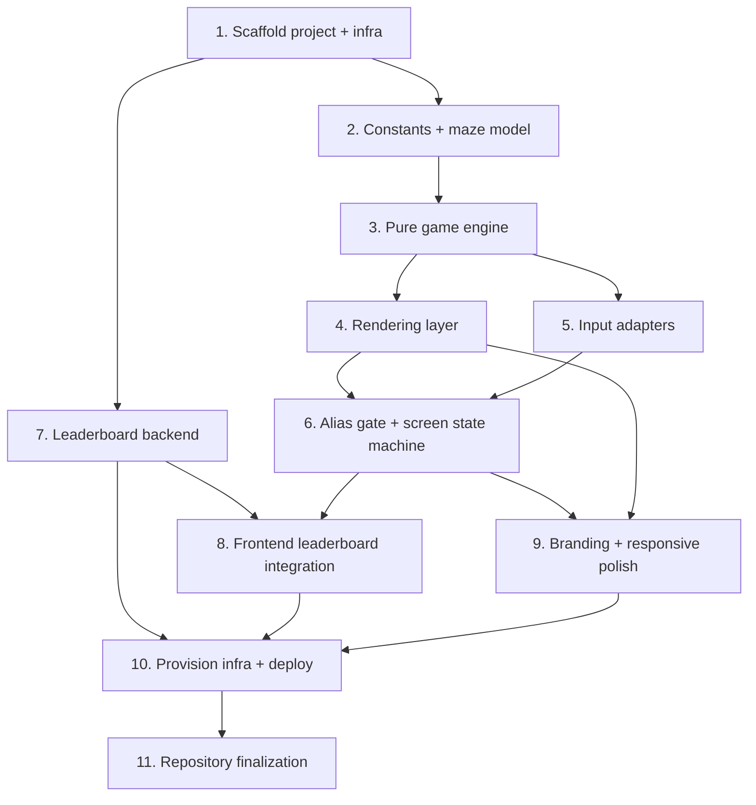

# Implementation Plan

## Overview

This plan sequences the Kiroman build end to end: project + infra scaffold first,
then the pure game engine (test-driven), then rendering and input, then the
serverless leaderboard, then branding/responsive polish, then deployment. Tasks
are ordered so each builds on the previous, and the correctness properties from
the design are exercised as the engine is built.

## Tasks

- [ ] 1. Create the repo and scaffold via the LaunchPad bootstrap (reuse AccountRef account)
  - [x] 1.1 Confirm the Kiro-generated spec is present at `C:\Dev\kiroman\.kiro\specs\kiroman\` and leave it unmodified (it must land in the repo's first commit)
    - _Requirements: 8.6_
  - [-] 1.2 Run `C:\Dev\bootstrap\New-Project.ps1` with `-SkipAwsAccount` (enter the AccountRef account `468895763486`), `-SkipGitHub` (the target folder already exists with the spec), and `-SkipTerraform` (defer infra to the gated apply in Task 10), producing the React 19 + Vite + Tailwind scaffold, a dedicated `kiroman-terraform` IAM user/profile in the AccountRef account, `deploy.ps1`, and `.kiro/steering` docs — its local initial commit will include the untouched spec (no infra applied, no deploy yet)
    - _Requirements: 7.2, 8.4, 8.6_
  - [~] 1.3 Scaffold the `infra/bootstrap` + `infra/main` Terraform from the bootstrap templates for the `kiroman-terraform` profile and `kiroman-` resource names (files only — do not apply here)
    - _Requirements: 8.1, 8.4_
  - [~] 1.4 Create the public GitHub repo `dustin-lap1/kiroman` from the local folder and push (`gh repo create dustin-lap1/kiroman --public --source . --remote origin --push`), so the repository's first commit contains the Kiro-generated spec unmodified
    - _Requirements: 8.6_
  - [~] 1.5 Verify `npm install` and `npm run dev` run the "Welcome to Kiroman!" scaffold locally
    - _Requirements: 7.2, 8.1_

- [ ] 2. Establish shared constants and the maze model
  - [~] 2.1 Create `src/game/constants.js` (tile size, base/max chaser speed, starting lives, pellet value) and `src/game/maze.js` (wall + pellet grid for at least one maze layout)
    - Provide helpers: `isWall(maze, tile)`, `pelletTiles(maze)`, `tileToPixel`/`pixelToTile`
    - _Requirements: 2.1_
  - [~] 2.2 Write unit tests for the maze model (walls are impassable, pellet set matches layout)
    - _Requirements: 2.1, 2.2_

- [ ] 3. Build the pure game engine (test-driven)
  - [~] 3.1 Implement `createInitialState()` and grid-aligned movement with turn buffering in `src/game/engine.js` + `src/game/entities.js`
    - Directional intents move Kiroman unless a wall blocks; `nextDir` applied when path opens
    - _Requirements: 2.2_
  - [~] 3.2 Implement pellet collection, scoring, and level-up
    - Consuming a pellet removes the tile and adds score; empty pellet set advances level, increments `level`, preserves score/lives
    - _Requirements: 2.3, 3.1, 3.2, 3.4_
  - [~] 3.3 Implement chaser pursuit AI, life loss on contact, and game over
    - Chasers pursue Kiroman each step; contact costs a life and resets positions; zero lives → `gameover`; track `highestLevel`
    - _Requirements: 2.4, 2.5, 2.6, 3.5_
  - [~] 3.4 Implement difficulty scaling and pause behavior
    - `src/game/difficulty.js` maps level → chaser speed (non-decreasing, capped); `pause` intent toggles `playing`↔`paused`; movement intents ignored while paused
    - _Requirements: 3.3, 4.1, 4.3, 4.4, 4.5_
  - [~] 3.5 Add property-based tests for the engine
    - Cover design Properties 1–7 (no wall clipping, pellet conservation, level-up trigger, difficulty monotonic/capped, score/lives preserved, pause freezes state, highest-level running max)
    - _Requirements: 2.2, 2.3, 3.1, 3.2, 3.3, 3.5, 4.3, 4.5_

- [ ] 4. Rendering layer
  - [~] 4.1 Implement `src/render/canvasRenderer.js` to draw a given state (walls, pellets, Kiroman with chomp animation, Kiro chasers)
    - _Requirements: 2.1, 7.1, 7.3_
  - [~] 4.2 Implement `src/render/useGameLoop.js` (fixed-timestep `step` + `render` via `requestAnimationFrame`) and `src/components/GameCanvas.jsx`
    - _Requirements: 2.1, 2.4_

- [ ] 5. Input adapters (web + mobile)
  - [~] 5.1 Implement `src/input/useKeyboard.js` (arrows/WASD → direction, Space → pause with preventDefault)
    - _Requirements: 4.1, 6.1_
  - [~] 5.2 Implement `src/input/useTouch.js` + `src/components/TouchControls.jsx` (on-screen d-pad + tap-to-pause on coarse-pointer devices)
    - _Requirements: 4.2, 6.2_

- [ ] 6. Alias gate and screen state machine
  - [~] 6.1 Implement `src/components/AliasGate.jsx` with 1–12 char trimmed validation and inline error messaging
    - _Requirements: 1.1, 1.2, 1.3, 1.5_
  - [~] 6.2 Wire the screen state machine in `App.jsx` (alias gate → playing → paused → game over), persisting the alias for the session
    - _Requirements: 1.4, 4.3, 2.6_
  - [~] 6.3 Implement `src/components/PauseOverlay.jsx` (visible paused indicator) and `src/components/GameOverCard.jsx` (result + play again)
    - _Requirements: 4.3, 2.6, 3.5_

- [ ] 7. Leaderboard backend (Lambdas + DynamoDB + API)
  - [~] 7.1 Define Terraform for the DynamoDB table `kiroman-leaderboard` (pk/alias keys, PAY_PER_REQUEST) in `infra/main`
    - _Requirements: 8.3_
  - [~] 7.2 Implement `functions/getLeaderboard` (query `pk=LEADERBOARD`, sort level desc then achievedAt asc, return top 3) with unit tests
    - _Requirements: 5.1, 5.2, 5.6_
  - [~] 7.3 Implement `functions/submitScore` (validate alias 1–12 + positive integer level; conditional upsert keeping only higher level) with unit tests
    - _Requirements: 5.3, 5.4, 5.5_
  - [~] 7.4 Define Terraform for both Lambdas (Node.js 22, `ignore_changes` on code), the HTTP API + routes (`GET /leaderboard`, `POST /scores`), IAM, and CORS for the CloudFront origin
    - _Requirements: 8.2, 8.5_

- [ ] 8. Frontend leaderboard integration
  - [~] 8.1 Implement `src/api/leaderboard.js` (`getLeaderboard`, `submitScore`) against `config.API_BASE`, failure-tolerant, with mocked-fetch tests (design Property 10)
    - _Requirements: 5.1, 5.3, 5.7_
  - [~] 8.2 Implement `src/components/Leaderboard.jsx` to fetch on page load and render the top 3; submit on game over; show non-blocking notices on failure
    - _Requirements: 5.1, 5.2, 5.3, 5.7_

- [ ] 9. Branding, responsiveness, and polish
  - [~] 9.1 Apply Kiro brand palette as Tailwind tokens shared by DOM and canvas; add the "Welcome to Kiroman!" header and use `kiro-image.png` as the chaser sprite
    - _Requirements: 7.1, 7.2, 7.3_
  - [~] 9.2 Make the board scale to the viewport (preserve aspect ratio), reflow the vertical layout without horizontal scroll, and add playful animations respecting `prefers-reduced-motion`
    - _Requirements: 6.3, 6.4, 7.4_

- [ ] 10. Provision infrastructure and deploy
  - [~] 10.1 Provision infra plan-first with the `kiroman-terraform` profile: `terraform init` + `apply` the bootstrap state backend, then `terraform plan` the main stack, present the plan for review, and `apply` only after approval; deploy Lambda code and capture the API base URL into frontend config
    - _Requirements: 8.1, 8.2, 8.3, 8.4, 8.5, 8.6_
  - [~] 10.2 Build and deploy the frontend via `deploy.ps1` (S3 sync + CloudFront invalidation) and verify end to end on desktop and mobile (play, pause/resume, level up, leaderboard refresh on load)
    - _Requirements: 6.1, 6.2, 6.3, 8.1_

- [~] 11. Repository finalization (challenge compliance)
  - Confirm the Kiro-generated spec (`.kiro/specs/kiroman/`) remained unmodified from the first commit made in Task 1 through implementation
  - Add a project README documenting local dev, the deploy flow (`deploy.ps1`), and the live CloudFront URL, then push the finished build to `dustin-lap1/kiroman`
  - _Requirements: 8.6_

## Task Dependency Graph

```json
{
  "waves": [
    { "wave": 1, "tasks": ["1"], "dependsOn": [] },
    { "wave": 2, "tasks": ["2", "7"], "dependsOn": ["1"] },
    { "wave": 3, "tasks": ["3"], "dependsOn": ["2"] },
    { "wave": 4, "tasks": ["4", "5"], "dependsOn": ["3"] },
    { "wave": 5, "tasks": ["6"], "dependsOn": ["4", "5"] },
    { "wave": 6, "tasks": ["8", "9"], "dependsOn": ["6", "7"] },
    { "wave": 7, "tasks": ["10"], "dependsOn": ["8", "9"] },
    { "wave": 8, "tasks": ["11"], "dependsOn": ["10"] }
  ]
}
```



## Notes

- **Test-driven core:** Tasks 2–3 build the pure engine with unit and
  property-based tests before any rendering, so the correctness properties in the
  design are locked in early and remain independent of the DOM/canvas.
- **Parallelizable branches:** after the engine (Task 3), rendering (4) and input
  (5) can proceed in parallel, and the leaderboard backend (7) can be built
  alongside the frontend gameplay work since it only depends on the scaffold (1).
- **Challenge compliance:** Task 1 creates the repo's first commit *with* the
  Kiro-generated spec already in place (via bootstrap `-SkipGitHub` + create-from-
  local), and Task 11 verifies it stayed unmodified through implementation. Because
  the spec pre-exists in `C:\Dev\kiroman`, we create the repo from the local folder
  rather than `gh repo create --clone` (which would collide with the folder and
  make the scaffold, not the spec, the first commit).
- **Infra safety:** the bootstrap runs with `-SkipTerraform`, so no infra is
  applied during scaffolding. All Terraform is applied in Task 10 plan-first
  (present the plan, apply only after review) using the dedicated
  `kiroman-terraform` profile and `kiroman-` resource prefix, so nothing touches
  AccountRef's existing resources.
